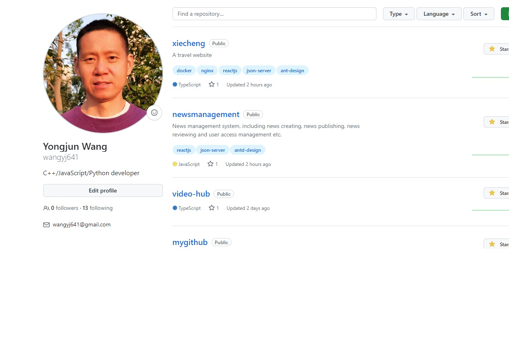

# MyGitHub

A personal github web app.

Developed with next.js, react, TailwindCss koa, Redis.



### Key Features:

- TailwindCSS UI design
- Github authentication integration
- Login your github account
- View your repositories list
- View a repository detail
- Search repositories


### Getting Started

##### Config
- Register a OAuth app
```
github -> settings -> Developer settings -> OAuth apps
```
- Edit global.config.js
```
// Github OAuth app client id
const client_id = '246560ac02e68a37f12b';
// Github OAuth app Client Secret
const client_secret = 'a41f9423c793d224b3d268efb1d26e28e9faa281';

const SCOPE = 'user';

const GITHUB_OAUTH_URL = 'https://github.com/login/oauth/authorize';
```

##### Start the app

```shell
npm run dev
```

Open [http://localhost:3000](http://localhost:3000) with your browser to see the result.

