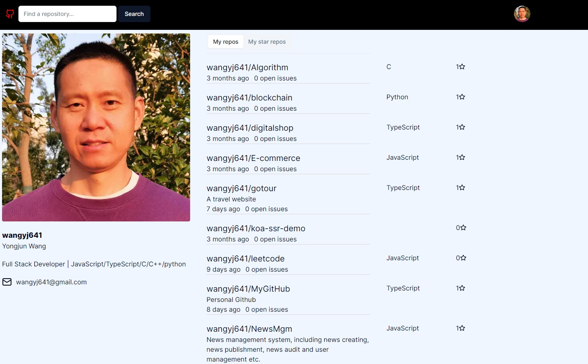

# MyGitHub

This is a personal github Webapp.

Developed with next.js, react, tailwindCss koa, Redis.



### Key Features:

- Login your github account
- View all your repositories
- Search repositories
- TailwindCSS UI design
- Github authentication integration

## Getting Started

### Register a github OAuth app

### Start the app

```shell
npm run dev
```

Open [http://localhost:3000](http://localhost:3000) with your browser to see the result.

